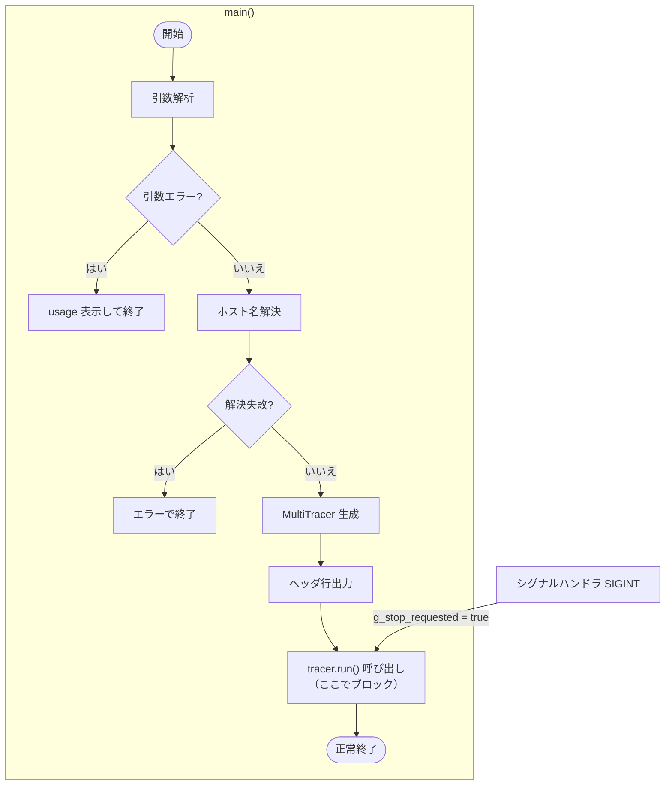
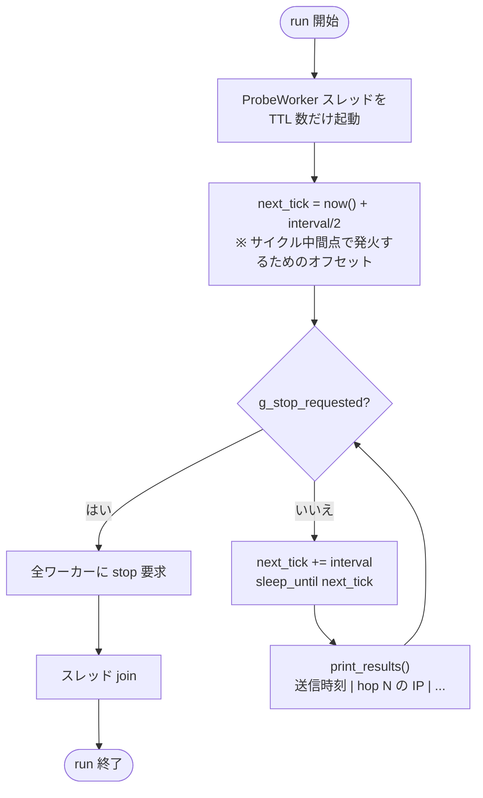
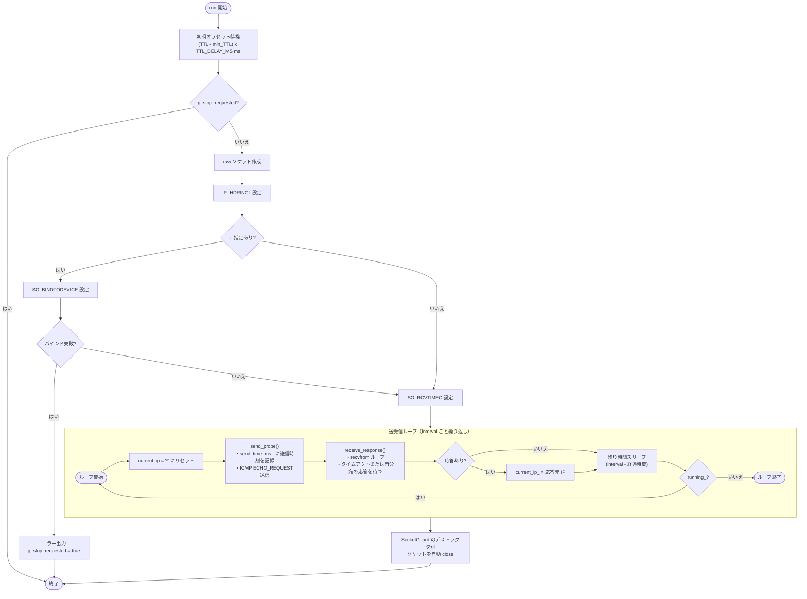
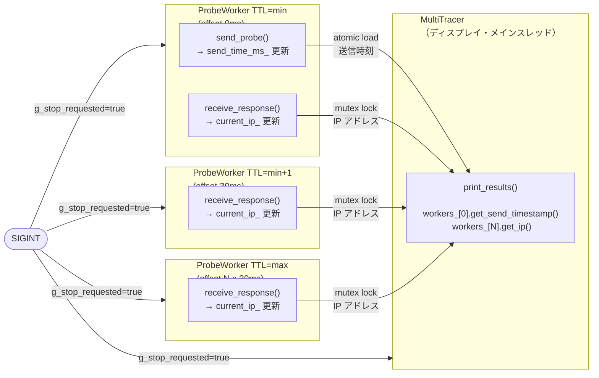

# multiroute フローチャート

## 全体構成

```mermaid
flowchart TD
    subgraph MAIN["main()"]
        A([開始]) --> B[引数解析]
        B --> C{引数エラー?}
        C -- はい --> D[usage 表示して終了]
        C -- いいえ --> E[ホスト名解決]
        E --> F{解決失敗?}
        F -- はい --> G[エラーで終了]
        F -- いいえ --> H[MultiTracer 生成]
        H --> I[ヘッダ行出力]
        I --> J["tracer.run() 呼び出し\n（ここでブロック）"]
        J --> K([正常終了])
    end

    SIG["シグナルハンドラ SIGINT"] -- "g_stop_requested = true" --> J
```

---

## MultiTracer::run() — ディスプレイスレッド（メインスレッド）

```mermaid
flowchart TD
    A([run 開始]) --> B["ProbeWorker スレッドを\nTTL 数だけ起動"]
    B --> C["next_tick = now() + interval/2\n※ サイクル中間点で発火するためのオフセット"]
    C --> D{g_stop_requested?}
    D -- はい --> E[全ワーカーに stop 要求]
    E --> F[スレッド join]
    F --> G([run 終了])
    D -- いいえ --> H["next_tick += interval\nsleep_until next_tick"]
    H --> I["print_results()\n送信時刻 | hop N の IP | ..."]
    I --> D
```

---

## ProbeWorker::run() — 各 TTL ワーカースレッド（並列動作）

```mermaid
flowchart TD
    A([run 開始]) --> B["初期オフセット待機\n(TTL - min_TTL) x TTL_DELAY_MS ms"]
    B --> C{g_stop_requested?}
    C -- はい --> Z([終了])
    C -- いいえ --> D[raw ソケット作成]
    D --> E[IP_HDRINCL 設定]
    E --> F{-if 指定あり?}
    F -- はい --> G[SO_BINDTODEVICE 設定]
    G --> H{バインド失敗?}
    H -- はい --> I["エラー出力\ng_stop_requested = true"]
    I --> Z
    H -- いいえ --> J
    F -- いいえ --> J[SO_RCVTIMEO 設定]

    J --> LOOP

    subgraph LOOP["送受信ループ（interval ごと繰り返し）"]
        L0([ループ開始]) --> L1["current_ip = '*' にリセット"]
        L1 --> L2["send_probe()\n・send_time_ms_ に送信時刻を記録\n・ICMP ECHO_REQUEST 送信"]
        L2 --> L3["receive_response()\n・recvfrom ループ\n・タイムアウトまたは自分宛の応答を待つ"]
        L3 --> L4{応答あり?}
        L4 -- はい --> L5["current_ip_ = 応答元 IP"]
        L4 -- いいえ --> L6
        L5 --> L6["残り時間スリープ\n(interval - 経過時間)"]
        L6 --> L7{running_?}
        L7 -- はい --> L0
        L7 -- いいえ --> L8([ループ終了])
    end

    LOOP --> K["SocketGuard のデストラクタが\nソケットを自動 close"]
    K --> Z
```

---

## スレッド間のデータ共有

```mermaid
flowchart LR
    subgraph MT["MultiTracer\n（ディスプレイ・メインスレッド）"]
        D["print_results()\n workers_[0].get_send_timestamp()\n workers_[N].get_ip()"]
    end

    subgraph W0["ProbeWorker TTL=min\n(offset 0ms)"]
        W0S["send_probe()\n→ send_time_ms_ 更新"]
        W0R["receive_response()\n→ current_ip_ 更新"]
    end

    subgraph W1["ProbeWorker TTL=min+1\n(offset 30ms)"]
        W1R["receive_response()\n→ current_ip_ 更新"]
    end

    subgraph WN["ProbeWorker TTL=max\n(offset N x 30ms)"]
        WNR["receive_response()\n→ current_ip_ 更新"]
    end

    W0S -- "atomic load\n送信時刻" --> D
    W0R -- "mutex lock\nIP アドレス" --> D
    W1R -- "mutex lock\nIP アドレス" --> D
    WNR -- "mutex lock\nIP アドレス" --> D

    SIG(["SIGINT"]) -- "g_stop_requested=true" --> MT
    SIG -- "g_stop_requested=true" --> W0
    SIG -- "g_stop_requested=true" --> W1
    SIG -- "g_stop_requested=true" --> WN
```
